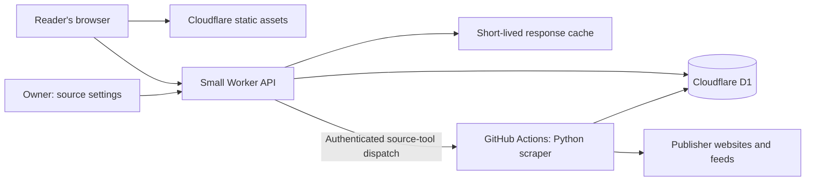

# High Signal: Cloudflare migration implementation plan

Prepared September 9, 2026. Status: **implementation in progress; no Cloudflare
resources provisioned and no production traffic changed**.

### Implementation checkpoint — September 10, 2026

The first two reviewable slices are implemented locally:

- D1 schema plus parameterized, idempotent stage/verify/activate/prune primitives.
- Flask-independent Python scrape/document pipeline and an explicit `STATE_BACKEND=d1`
  CI path; the current Blob job remains the default until the repository variable changes.
- Dry-run/remote state importer and an isolated local Wrangler D1 importer.
- Generated static assets and a TypeScript Worker with the bundled dashboard read,
  compatibility reads, ETags, bounded query parameters, exports/RSS and JSON 404s.
- Offline D1/pipeline tests, TypeScript contract tests and a credential-isolated local
  Worker smoke test using the current 198-article cache.
- A single client `/api/dashboard` read on a five-minute visible-tab cadence, with a
  bounded current/previous IndexedDB fallback and an explicit stale-data banner.
- SHA-256 checked bearer-token owner routes, authoritative revisioned source CRUD,
  private-target rejection and memory-only owner credentials in the browser.
- Bounded asynchronous discovery/test jobs dispatched to a fixed GitHub workflow,
  idempotent pending requests, a 20/day database-enforced limit, durable retry/result
  states, hidden-tab polling suspension and small scheduled recovery batches.
- Cleanup for expired tool jobs and abandoned staging publications. Local browser QA
  covered owner source add/delete, async completion, token non-persistence and a full
  dashboard reload while D1 had no active publication.

### Preview checkpoint — September 10, 2026

A Free-plan preview is deployed and serving the current snapshot:

- Worker `high-signal-dashboard-preview` at
  <https://high-signal-dashboard-preview.krishayd.workers.dev>.
- D1 `high-signal-preview` (`3b33be5d-bfa7-4f67-a3fb-afcab5659e2b`, APAC) with both
  migrations applied, 27 sources and the 206-article snapshot active.
- Owner token installed as a Worker secret. No production resource, DNS record or
  Vercel setting was touched, and no repository variable was changed.

Measured on that deployment with `wrangler tail` (CPU per invocation; the Free
limit is 10 ms, with documented flexibility for infrequent overruns):

| Read | 206 articles (154 KB document) | 1,000 articles (727 KB, synthetic) |
| --- | --- | --- |
| `/api/dashboard` (what the browser polls) | 4 ms cold, 0–1 ms cached | 1 ms cold, 0 ms cached |
| `/api/stats`, `/api/sources` | 3–5 ms | 0–3 ms |
| `/api/health`, `/api/refresh/status` | 1–4 ms | 1–2 ms |
| `/api/export.json`, `/feed.xml` | 4–7 ms | 0–1 ms |
| Unfiltered `/api/feed`, `/api/categories`, `/api/grouped` | 1–7 ms | 0–2 ms cached |
| Filtered `/api/feed?…`, `/feed.xml?category=…`, `/api/grouped` cold | 8–9 ms | 22–38 ms |

Before this pass the same reads cost 3–7 ms at 206 articles and 13–25 ms at 1,000,
because every compatibility read parsed the whole feed document. Three changes closed
that gap: the publisher now prepares `stats` and `sources` documents the Worker returns
as stored text, status reads answer from publication metadata instead of the feed body,
and every published read is edge cached by canonical URL with an `x-cache` header. Cache
entries are per data centre — repeated reads showed `hit` in SIN and `miss` on the first
HKG request — so cold cost still matters and is what the table reports.

The supported payload is therefore a dashboard document up to about **300 KB
(roughly 400 articles)**. Past that, uncached *filtered* compatibility queries
risk Error 1102 on Free; the browser path and every prepared document stay cheap
because they are never parsed in the Worker. `scrape_job.py` prints a warning when
a published document crosses that budget.

D1 cost per read, measured through the REST API on the same database: 3 rows for a
document read, 2 for the publication metadata read, 54 for the owner's 27-source
listing. Publishing the 206-article snapshot with five documents cost 95 rows written.

Saved-state transfer now ships in the shared client: the reading-tools menu exports
`hs.read`/`hs.saved`/`hs.hidden`/`hs.pinned` as `high-signal-reading-state.json` and
merges an imported file back in, keeping whatever the current browser already has.
Because the file is written by `static/js/dashboard.js`, the existing Vercel origin
offers the same export on its next deployment. Browser-verified against the preview:
export, import into a fresh profile, a repeat import that adds nothing, and a refused
file that leaves existing state intact.

Not implemented at this checkpoint: repository Cloudflare credentials, a real CI
publication into D1, production provisioning, cutover or DNS.
`.github/workflows/deploy.yml` runs the regression suite on pull requests and deploys
the Worker on relevant pushes, but it skips the deployment step with a notice until
`CLOUDFLARE_API_TOKEN` and `CLOUDFLARE_ACCOUNT_ID` are configured.

Local reproduction after `npm install`:

```bash
.venv/bin/python -m unittest discover -s tests -v
npm run check && npm test && npm run build
npx wrangler d1 migrations apply high-signal-preview --local
python3 scripts/import_state.py --local
npx wrangler dev --local
```

## 1. Outcome and constraints

Replace the hosted Vercel + Vercel Blob deployment with:

- Cloudflare Workers Static Assets for the existing HTML, CSS, JS, icons and manifest.
- A small TypeScript Worker for the dashboard API and owner-only configuration changes.
- Cloudflare D1 for published feed snapshots, source configuration and bounded background jobs.
- GitHub Actions for the existing Python scraper, publisher summaries and source discovery/testing.

Target Workers **Free**, D1 on that Free plan, and standard GitHub-hosted runners in this public repository. Do not enable a paid subscription. Use the provided `workers.dev` hostname initially; buying a domain is unnecessary.

Success means the deployed website and scheduled scraper work with **no Vercel account access, Blob token, R2 bucket, paid model calls or continuously running laptop**. GitHub stores code and runs jobs; it is not the production feed database. A headline update must not rebuild/redeploy the website or commit feed JSON into Git history.

Preserve the current design and reading experience: category/feed/source views, pipeline visualization, ranking, filtering, publisher summaries, pins, saved items, hidden/read state, theme, export and RSS. Keep article IDs and localStorage keys compatible. No React conversion, visual redesign or scoring rewrite.

“Free and scalable” means staying within explicit free limits with efficient reads and bounded writes, plus a straightforward future capacity upgrade. It does not mean unlimited traffic, guaranteed scrape timing or unlimited data retention for $0.

## 2. Starting point: inspect before changing anything

Workspace: `/Users/pixledust/conductor/workspaces/high-signal-dashboard/bangui`

- Current branch at planning time: `fix/vercel-hobby-operations`.
- Target/base branch: `origin/main`.
- There are substantial **uncommitted changes**, including Hobby storage fixes, summary improvements and newer UI/pipeline work. These are part of the working baseline. Do not reset, stash away, overwrite or omit them when building the migration.
- Modified files include `app.py`, `scraper.py`, `store.py`, `scrape_job.py`, the workflow, deployment configuration/docs, `templates/index.html`, both stylesheets and `static/js/dashboard.js`.
- Additional files include `tests/`, `pipeline-overview.png`, and `pipeline-overview.svg`. Recheck status; other work may have landed since this plan.
- Do not rename the current branch. The user has not yet requested a migration branch or production cutover in this planning task.

Current deployed production was `https://bangui-one.vercel.app`. The Blob store was suspended after consuming its 2,000 advanced operations. An offline migration must work even if that store remains unreadable.

Local preview: `.context/local-preview/serve.py`, with isolated `data/cache.json` and `data/sources.json`. At inspection, that snapshot had a September 9 timestamp and was newer than root `cache.json`. Validate actual timestamps and source edits rather than assuming either copy is authoritative. These preview files are test data, not proof of production state. Preserve a copy before imports.

### Relevant code

| File | Responsibility / migration treatment |
| --- | --- |
| `scraper.py` | Keep Python extraction, feeds, deduplication, scoring, categories, date parsing, IDs, first-seen tracking and publisher-text summary helpers |
| `app.py` | Flask HTTP contracts, response shaping, source validation/discovery, summary warming, startup and refresh handling; separate reusable logic from the Flask process |
| `scrape_job.py` | Scheduled job currently imports Flask app and writes Blob; replace with an explicitly configured D1 job/publisher |
| `store.py` | Local and Blob storage selected by token; replace deployment-dependent assumptions with explicit backend/capability selection |
| `templates/index.html` | Existing page; currently contains only a small set of Jinja `url_for('static', ...)` asset references to resolve at build time |
| `static/js/dashboard.js` | Existing client; currently polls `/api/feed`, `/api/stats`, `/api/sources` together every visible minute |
| `.github/workflows/scrape.yml` | Scheduled/manual scrape, Python 3.12, shared concurrency group, dependency installation and storage regression tests |
| `tests/test_hobby_storage.py` | Existing 19 regression tests for no incidental uploads, publication failure, refresh, polling and source changes |
| `.context/hobby-ui-smoke.py` | Existing Playwright smoke checks; useful evidence, not a production module |
| `DEPLOY.md` | Rewrite around the final Cloudflare deployment after implementation |

The current Hobby implementation already removes Blob listings, publishes one snapshot with health and warmed summaries, caches click-fetched summaries in the browser, pauses hidden-tab polling, preserves warm state on errors, and makes hosted Refresh read-only. Preserve those behaviors where applicable.

## 3. Architecture decisions



### Keep the expensive work in Python

Do not port `cloudscraper`, BeautifulSoup parsing, discovery heuristics or the full scraping loop into a Worker request. Workers Free has a **10 ms CPU budget per invocation**. Network waiting is different from CPU time, but parsing and transforming large documents still matters. Keep scoring and feed-response preparation in the Python job; make the common Worker path return prepared content. [Workers limits](https://developers.cloudflare.com/workers/platform/limits/)

Use TypeScript for the thin Worker. Python Workers/Flask support exists, but lifting this Flask application directly would retain unnecessary scheduler/process assumptions and put dependency compatibility and CPU limits on the critical path.

### Explicit backends, no token-dependent behavior

Introduce explicit configuration such as `STATE_BACKEND=local|d1` and explicit execution modes. Do not simply teach `is_remote()` that D1 is another Blob: it currently controls startup, filesystem persistence, summary writes and refresh semantics in several unrelated places.

- Local mode must remain usable with fixtures and no Cloudflare credentials.
- D1 mode must fail clearly when required configuration is missing.
- A CI missing-secret error must never silently run a local-only scrape and report successful publication.
- Importing scraper/job modules must not start APScheduler or issue publication writes.
- The hosted Worker must never import or require Python.

## 4. D1 storage and atomic publication

Use a document snapshot for the read-heavy feed and separate rows for independently edited configuration. Do not normalize every article into a freshly rewritten table just to reassemble the whole feed on each request. This is a migration of a few hundred-headline dashboard, not an archive/search product.

Proposed initial schema; finalize exact column types and names during implementation:

| Table | Fields / purpose |
| --- | --- |
| `sources` | `id` stable primary key, unique `name`, `config_json`, `revision`, `updated_at`, optional `deleted_at`; authoritative owner configuration |
| `publications` | `id` primary key, `generated_at`, `schema_version`, `manifest_json`, `ready`, `created_at`; identifies a complete generation |
| `publication_documents` | composite primary key `(publication_id, key)`, `body_text`, `content_type`, `etag`, `byte_count`; prepared dashboard, RSS/export and bounded compatibility responses |
| `app_state` | singleton key for the active publication ID; optionally last successful run metadata |
| `tool_jobs` | `id`, `kind`, `payload_json`, `state`, `result_json`, `error`, `requested_at`, `claimed_at`, `finished_at`, `expires_at`, `idempotency_key`; bounded owner-only discovery/test work |
| `run_log` | run ID, status, timestamps, counts and short error; retain at most seven days |

Indexes: primary keys and only the additional lookup indexes actually used (e.g. job state/time). Index writes consume D1 row-write allowance too. Do not index every JSON field.

### Documents

Start with a prepared `dashboard` response containing articles, stats, source-health snapshot, publication ID and generated time. Preserve existing article fields. Prepare exports/RSS in Python as separate documents where necessary. The default dashboard Worker response should pass the stored JSON through without parsing and serializing hundreds of articles.

Keep each document comfortably below D1's **2,000,000-byte row/string limit**; use a 1 MB warning threshold and reject an oversized publication before activation. Test with realistic growth fixtures. If growth requires splitting the feed, implement bounded chunks/pagination with an explicit client contract, never silent truncation. D1 Free permits **500 MB per database**; the advertised 5 GB is the total account allowance, not one database. [D1 limits](https://developers.cloudflare.com/d1/platform/limits/)

Retain the current and two preceding successful publications. Prune abandoned staging publications after 24 hours and completed tool jobs after 24 hours. No unbounded append-only article history in migration v1. Keep original article IDs and first-seen values in every new generation so existing browser bookmarks still match.

### Publication sequence

1. Read authoritative source configuration and the active previous snapshot.
2. Scrape with the existing Python engine; carry forward existing IDs, first-seen dates, useful summaries and failure history.
3. Prepare summaries and serialize the final dashboard/exports **before** publication.
4. Validate the manifest, schemas, document sizes, source coverage, article counts and timestamps. If all enabled sources unexpectedly fail, fail the job and retain the prior publication. Report partial failures explicitly; do not silently make up fresh timestamps for old content.
5. Stage documents under a unique generation ID. Repeating a stage request with the same ID and content must be idempotent.
6. Verify every manifest entry and its content hash/size. Mark the publication ready only when complete.
7. Atomically switch `app_state.active_publication_id`, conditional on the expected prior generation and readiness. A reader sees either the old complete generation or the new complete generation.
8. Log outcome/row usage, then prune old generations. A pruning failure cannot invalidate an already successful publication.

CI can use the D1 REST API for this low-volume administrative workload. Parameterize all SQL. A staged generation and a single conditional pointer-switch statement avoid relying on transactions spanning multiple HTTP requests. If using the Worker binding for any multi-statement operation, use documented transactional `DB.batch()` behavior; do not invent a `BEGIN`/`COMMIT` transaction across network calls. [D1 REST query](https://developers.cloudflare.com/api/resources/d1/subresources/database/methods/query/), [D1 batch](https://developers.cloudflare.com/d1/worker-api/d1-database/)

CI must not overwrite `sources` as part of publishing an older scrape. A source edit during a scrape remains authoritative and is consumed by the next run. Until then, show health as “last checked” and owner edits as pending application where appropriate.

## 5. HTTP and frontend contracts

First record the current routes and representative responses as fixtures. The route inventory below is a starting point, not permission to drop a route that the latest client uses.

| Route / behavior | Proposed Cloudflare implementation |
| --- | --- |
| `/`, `/static/*`, icons, manifest | Static assets; preserve existing paths; do not invoke Worker for matching assets |
| New `/api/dashboard` | One prepared payload replacing the client's three polling requests; stable cache key and ETag |
| `/api/feed`, `/api/articles`, `/api/grouped`, `/api/categories`, `/api/high_signal` | Preserve compatibility contracts and query behavior; reuse prepared documents or tightly bounded transformations; CPU-test uncommon query paths |
| `/api/stats`, public `/api/sources` | Preserve read contracts; can use prepared documents; owner settings use an uncached authoritative source endpoint |
| `/api/article/<id>/summary` | Serve prepared publisher text where available; preserve browser caching; use bounded on-demand metadata fallback as described below |
| `POST /api/refresh` | Re-check the latest published feed; no scrape, database publication or GitHub dispatch for ordinary readers |
| `/api/refresh/status` | Durable publication/run status rather than process-local Flask state; keep client compatibility |
| `/api/health` | Actual storage/publication freshness status, no scraping and no fabricated next-run promise |
| `/api/export.json`, `/feed.xml` | Preserve content types, attachment behavior, RSS validity and supported query options |
| Source create/edit/delete | Owner-authenticated Worker writes to `sources`, revision checks to prevent lost edits; no feed publication |
| Source discovery/test | Owner-authenticated asynchronous job, processed by the existing Python code in GitHub Actions |

Resolve the few Jinja asset URLs in a deterministic build step into a generated static output directory. Avoid maintaining two independently edited copies of the page. Preserve the newest CSS/HTML/JS and existing asset names, including any pipeline visualization used by the page.

Configure static assets first, with Worker routing only for API and feed endpoints. Unknown `/api/*` requests must return JSON 404, not the website HTML. Do not use an unrestricted SPA fallback that hides broken endpoints. [Static asset routing](https://developers.cloudflare.com/workers/static-assets/routing/worker-script/)

### Sorting and client behavior

Keep filtering/search/category grouping on the client. If sorting currently requires separate server results, port the small ordering helpers with parity fixtures, including mixed-source round-robin and date tie-breaks. Alternatively prepare the finite supported sort variants in Python. Pick one approach; do not maintain subtly different ranking algorithms in both languages.

Fetch one dashboard bundle on initial load and poll while visible every **five minutes**. Refresh and returning to the tab check immediately. Keep the existing “new headlines” pill rather than moving rows under the reader. This changes notification latency by up to roughly four minutes compared with one-minute polling, plus cache delay, but source scraping remains scheduled every 30 minutes.

Use IndexedDB or another explicitly bounded browser store for the last successful dashboard snapshot; a cold Worker cannot provide an in-memory fallback from a previous instance. Store only the current and previous client snapshot. Corrupt/full browser storage must not break loading. On a network/D1 error, show the retained feed with its real age and an error banner. A first-time visitor during a total outage may still receive an unavailable screen; do not promise guaranteed offline availability.

Existing saved/read/hidden/pinned/theme state remains in its current localStorage format. Changing to a new hostname means browsers will not automatically bring that state across: provide export/import for those preferences and saved items before cutover, and explain the one-time transfer. Preserve IDs so imported saved items remain useful.

## 6. Summaries and source tools: explicit product decisions

### Summaries

- Preserve the non-AI rule: publisher feed text, metadata or body text; existing factual fallback only when extraction fails.
- Reuse Python summary preparation during scheduled runs and include results in the published snapshot. Keep bounded workers, per-host politeness and a time budget.
- Ordinary reading must cause **no database writes**. Retain the existing bounded browser summary cache.
- An on-demand Worker fallback may fetch only an article already in the active publication, with tight response-size/time/redirect limits and public URL validation. Extract metadata with a streaming platform parser, not an unrestricted full-page Python-equivalent parser. Measure it against the Free CPU limit.
- If on-demand extraction cannot meet the limit reliably, return the existing factual fallback and let the next scheduled preparation retry. Flag this limitation in the release notes; never silently replace publisher text with generated prose.

### Source discovery and selector testing

These currently execute Python parsing synchronously inside Flask. Moving them blindly to a Worker is not an acceptable migration.

Default plan: retain their functionality through **asynchronous owner-only jobs**:

1. The owner submits discovery/test parameters; the Worker validates and creates a job with a stable ID.
2. The Worker requests a fixed GitHub workflow via `workflow_dispatch`. It passes only the job ID. Fetch targets and selectors are stored as validated job data, never interpolated into shell commands.
3. The Python job claims that specific job atomically, runs the existing discovery/test functions and saves the bounded result to D1.
4. The UI shows queued/running/completed/failed states. Poll with backoff; stop background polling when the tab is hidden. Refreshing the page must retain the job ID/state.
5. If dispatch fails, record the error and provide a retry. Do not claim the job is running. The scheduled workflow may recover unclaimed queued jobs within a small per-run cap.

Set an initial maximum of **20 source-tool jobs/day account-wide**, one pending job per identical request, maximum payload/result sizes, and a short job runtime timeout. Enforce limits through conditional D1 writes, not an in-memory lock. The job can run even if a feed snapshot already exists in the current half-hour; publication cooldown must not suppress discovery/test work.

**User-visible tradeoff:** these tools may take a few minutes to start because GitHub supplies the compute. They will not feel as immediate as the current Flask request. State this before implementation/cutover; if the owner requires immediate previews, resolve that requirement rather than deleting the tools or adding a paid service without agreement.

## 7. Access and credentials

Public visitors can read, filter, save locally and check for updates. Public visitors must not edit shared sources, submit scraping jobs, dispatch GitHub workflows or write D1.

Recommended minimal owner access: a separate admin API namespace with a high-entropy owner token supplied through an owner-only control. Store the token as a Worker secret; submit it in an Authorization header, never a URL or bundled JS. Keep entered credentials only in memory for the session, and return 401 before running database work. This is owner access, not a new public signup/accounts feature. Cloudflare Access can replace this if the user already has a compatible domain/setup; do not make a new paid domain a prerequisite.

Worker secrets:

- `ADMIN_API_TOKEN`: owner-only configuration/job actions.
- `GITHUB_ACTIONS_TOKEN`: fine-grained token restricted to this repository with only required Actions dispatch permission. Never return it to the browser.

GitHub secrets/variables:

- `CLOUDFLARE_ACCOUNT_ID`: account identifier (may be a variable).
- `CLOUDFLARE_D1_DATABASE_ID`: target database identifier (may be a variable).
- `CLOUDFLARE_D1_API_TOKEN`: narrowly scoped D1 access for the chosen account; follow actual supported token resource restrictions rather than assuming a database-level restriction exists.
- A separate deployment token for Worker deployment, if automated deployment is enabled. Keep publishing-data permissions separate from deploying-code permissions where supported.

Local configuration goes in ignored `.dev.vars`/environment files. Commit a placeholder-only example. Do not print credentials in logs, screenshots, SQL errors or the plan. Review redirects and private-network URLs for both discovery and summary fetches; scraping parameters are untrusted input even when copied from publisher pages.

## 8. Free-tier budget and monitoring

Budget against **both Worker requests and D1 rows**, not only stored megabytes.

| Resource | Free limit to verify at implementation | Design response |
| --- | --- | --- |
| Worker dynamic requests | 100,000/day | One bundled data request, five-minute visible polling, no Worker invocation for static assets |
| Worker CPU | 10 ms/invocation | Precompute documents in Python; pass through common response; benchmark real Free deployment |
| D1 rows read | 5 million/day | Indexed active-document lookups and response caching; avoid per-request full article-table scans |
| D1 rows written | 100,000/day | A small generation of documents per scrape, explicit owner edits, bounded job logs and cleanup |
| D1 database storage | 500 MB/database on Free | Keep three publications and short job/log retention; validate size before imports |
| GitHub Actions | Standard runners free for public repos, subject to usage policies | Keep repository public; bound jobs and retries; do not promise precise timers |

Sources: [Workers pricing](https://developers.cloudflare.com/workers/platform/pricing/), [D1 pricing](https://developers.cloudflare.com/d1/platform/pricing/), [D1 limits](https://developers.cloudflare.com/d1/platform/limits/), [GitHub Actions billing](https://docs.github.com/en/actions/concepts/billing-and-usage).

Example, not a capacity guarantee: 1,000 daily readers each keeping one tab open for 30 minutes generates roughly seven bundle requests each at five-minute polling, or about 7,000 requests/day before summaries, owner activity, RSS clients and bots. The existing three-requests-every-minute design would produce roughly 93,000 requests for that same simplified pattern. Tabs open all day produce much more usage.

Cache the public dashboard response for 60–120 seconds under a canonical key. Normalize/validate query parameters so arbitrary URLs cannot create unlimited cached variants. Respect ETags; a 304 still represents a request and does not by itself eliminate D1 reads unless the cache can answer it.

The Workers Cache API is local to each data center. Treat requests hitting the Worker as counting toward its allowance even when that Worker finds a cached response; do not claim caching makes dynamic requests unlimited. Never rely on a cache entry as the only durable copy. [Cache API](https://developers.cloudflare.com/workers/runtime-apis/cache/)

Record D1 `rows_read`/`rows_written`, actual query count, Worker CPU/error rates, publication age and failed jobs. Daily limits should have warning thresholds at 50% and 80%; implement visibility using supported free metrics/notifications and explain any manual notification setup. Avoid an elaborate always-running monitor that consumes more quota than the dashboard.

D1 daily limits block queries on Free until reset; storage limits require cleanup. No paid auto-upgrade. If traffic reaches the Worker cap, this architecture cannot guarantee the dynamic feed remains available without reducing traffic or increasing capacity. The client snapshot fallback protects returning readers but not every new visitor.

## 9. Implementation stages and suggested file boundaries

### Stage A — baseline and contracts

- Read current `git diff`, existing tests and this plan. Record the current visual baseline and route contracts.
- Preserve uncommitted work. Snapshot the current local data with provenance and timestamps; do not commit a private test dataset by accident.
- Add representative fixtures for scores, categories, IDs, dates, summaries, source status, export/RSS, stale state and source discovery results.
- Document the two planned UX changes: five-minute visible polling and asynchronous owner source tools. Confirm any objection before implementing dependent work.

### Stage B — separate Python pipeline from Flask

Suggested new files: `pipeline.py`, `source_tools.py`, `d1_store.py` or equivalent small modules.

- Extract only reusable scraping orchestration, summary preparation, source validation/discovery and response shaping needed by CI.
- Refactor `scrape_job.py` to call the pipeline directly, without Flask request/app/scheduler initialization.
- Preserve local-file mode for development and tests. Keep the legacy Flask server usable during transition.
- Add parameterized D1 access, retry rules, staging/activation and reporting. Retry transient failures with a cap; fail fast on authorization/quota errors. Unknown write outcomes require idempotency checks before retrying.

### Stage C — database migrations and data import

Suggested files: `migrations/0001_initial.sql`, `scripts/import_state.py`, migration tests.

- Create schema and apply it to local Wrangler D1 first.
- Import the explicitly selected source configuration and latest validated cache; preserve IDs, timestamps, summaries and health.
- Import must support dry-run and refuse to overwrite an initialized database without an explicit replacement option. Never publish an empty default because Blob is blocked.
- Test normal publication, concurrent source edits, duplicate publication, incomplete staging and rollback.

### Stage D — static site and Worker

Suggested files: `worker/src/index.ts`, small route/auth/cache modules, `wrangler.jsonc`, `package.json`, lockfile, `scripts/build_static.py`.

- Serve generated assets without a Worker invocation.
- Implement bundled reads, compatibility endpoints, headers/ETags, health/export/RSS and authenticated source editing.
- Return prepared payloads directly for the common path; no full Flask port.
- Integrate five-minute polling, source-tool job UI, last-good browser snapshot, owner controls and saved-state export/import into the existing client.
- Measure CPU and payload size early. A local test pass is insufficient proof of Free runtime compatibility.

### Stage E — GitHub jobs and deployment separation

- Adapt `.github/workflows/scrape.yml` for D1 and Python-only pipeline tests.
- Keep a shared publication concurrency group and idempotency. Use an off-peak half-hour schedule such as `7,37 * * * *`; timers are still best-effort. Test cooldown logic against the chosen schedule, including jobs finishing across interval boundaries.
- Add bounded source-tool dispatch mode, independent of feed publication cooldown.
- Deploy website code only on relevant code changes or explicit dispatch. Scrape publications must never redeploy the site.
- Run regression checks on PRs. Test jobs must not receive production write credentials.
- Keep Cloudflare preview and production D1 databases separate.

GitHub schedules can be delayed and public-repository schedules can be disabled after inactivity. Document recovery and monitor last successful publication rather than displaying an invented exact “next scrape” time. [GitHub workflow troubleshooting](https://docs.github.com/en/actions/how-tos/troubleshoot-workflows)

### Stage F — preview acceptance and cutover

- First deliver a local preview using Wrangler/local D1 and test fixtures, with no real secrets or live publisher requests required.
- Then provision a Free Cloudflare preview with a separate database and run one explicitly bounded real scrape.
- Present a reviewable preview URL, test evidence, actual D1/Worker usage, observed source failures and the remaining rollout steps.
- The current request authorizes planning only. A later implementation handoff should get work ready for review before any production traffic switch. Do not infer permission to purchase a plan, change DNS or remove production resources from this plan.

## 10. Acceptance tests: required before calling migration complete

### Pipeline and data

- Same fixture input produces the same IDs, scores/reasons, categories, deduplication and first-seen preservation as Python baseline.
- Full run produces complete dashboard, health, publisher summaries, export and RSS with no Blob requests and no Git commits.
- Failures during fetch, stage, finalize and cleanup preserve a usable active generation; retries are idempotent.
- A source edit during scraping survives publication; revision conflicts return actionable conflict responses.
- Secret missing, token denied, D1 quota exceeded, invalid/oversized JSON and total-source failure do not publish an empty successful feed.
- Same-slot duplicate dispatch does not publish twice; later legitimate scheduled runs are not suppressed by elapsed-duration mistakes.
- Cleanup retains the active generation and configured rollback generations and respects row-write budget.

### API, auth and quota

- No Vercel/Blob/R2 endpoint or credential is accessed with `STATE_BACKEND=d1`.
- Normal reading, Refresh, browser polling and prepared-summary expansion cause zero D1 writes.
- Static assets bypass dynamic API code; unknown APIs return JSON 404.
- Unauthenticated source edits, job creation/dispatch and result access are denied before costly work.
- Job retry/duplicate/dispatch-failure/timeout behavior works and the daily limit is shared across instances.
- Canonical cached reads and cold reads have measured row counts. Test 1,000 realistic articles or the documented supported payload size.
- Common and fallback endpoints fit the actual Workers Free CPU budget in preview. No silent paid-plan workaround.

### Browser and product

- Compare current desktop/mobile layouts, categories, pipeline display and keyboard behavior against screenshots.
- Verify search/filter/sort, score breakdown, article links, saved/read/hidden/pinned state and theme.
- Verify summary persistence across reloads and graceful fallback when the publisher blocks extraction.
- Verify public Refresh checks saved updates without scheduling work.
- Verify five-minute polling, no hidden-tab polling, immediate visible-tab refresh, pending-headline pill and stale/error banners.
- Verify a browser reload during a D1 outage shows the last locally retained feed; first-time/corrupt-storage cases fail clearly.
- Verify owner source add/edit/disable/delete plus asynchronous discovery/test, including reopening a pending job.
- Verify JSON export, RSS and old supported endpoint contracts.
- Verify saved-state export on the old origin and import on the new one without lost IDs.

Record the exact commands and results in the implementation PR. Run the existing Python regressions where still applicable, new D1/Worker tests, JavaScript checks, local browser tests and a bounded real Free-tier smoke test.

## 11. Rollout, rollback and definition of done

1. Back up selected local/source data and record the currently deployed versions. Keep the old resources intact.
2. Seed the separate Cloudflare database, deploy a preview and pass acceptance checks.
3. Configure GitHub credentials/permissions and validate one real D1 publication. Confirm source edits, scheduled execution and tool-job dispatch.
4. Deploy production Worker/assets and D1 on Free. Recheck static routing and usage counters.
5. Switch the public URL only after the owner accepts the preview and any hostname/state-transfer implications. If there is no custom domain, share the new `workers.dev` URL; do not imply the old Vercel URL moves automatically.
6. Stop the obsolete Blob publisher and remove Blob credentials from the migrated runtime/workflows after verifying the replacement. Do not delete old storage during initial cutover.
7. Observe at least two real scheduled publications and inspect failure/CPU/row usage before describing scheduled migration as verified.
8. Update `DEPLOY.md`, local startup instructions, configuration examples, monitoring/recovery instructions and the architecture overview to match what shipped.

Rollback has two parts: restore a known-good Worker deployment and point D1 at a retained complete publication. An application rollback does not automatically reverse a schema migration; use additive migrations during rollout. The old Vercel deployment is only a usable fallback if its Blob store is accessible. Otherwise keep the Cloudflare last-good publication; do not claim a rollback to a suspended backend restores service.

Done means code is migrated, Free-tier preview/production checks are recorded as applicable, the user-facing behavior is verified, secrets are properly configured, migration docs are accurate, and the hosted path has zero Blob dependency. If production approval/access is outstanding, say “implementation ready; cutover pending” rather than claiming the migration is live.

## 12. Paste this into the implementing agent

> Implement `docs/CLOUDFLARE_MIGRATION_PLAN.md` against the current working tree. First inspect current Git status and preserve all existing uncommitted Hobby, summary and UI/pipeline changes. Keep the existing dashboard design and Python scraping logic. Target Cloudflare Workers Static Assets + a small TypeScript API + D1 on the Free plan, with scraping in GitHub Actions and no Vercel Blob/R2 dependency. Work through the staged plan, test the Free-tier limits, and provide a local and then Cloudflare preview with evidence. Surface the planned source-tool latency and polling changes before implementing dependent UX. Do not buy services, change production traffic or delete existing resources without authorization. Report completed steps, test results, account setup still needed and any behavior differences.
